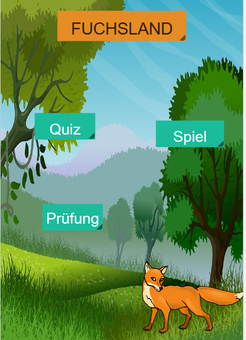
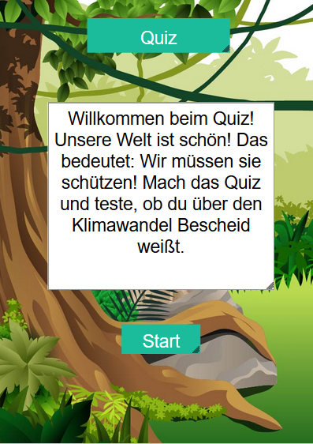

# Projektblog

## Fuchsland

## Inhaltsverzeichnis

* [Projektvorstellung](#projekt)
  * [Die Intention des Spiels](#Intention)
* [Das Spiel selber programmieren](#dssp)
  * [App Lab](#al)
  * [Erste Schritte](#erste)
  * [Das Spiel programmieren](#Spiel)
  * [Den Test programmieren](#Test)
    * [Die Fragen](#Fragen1)
  * [Das Quiz programmieren](#Quiz)
    * [Die Fragen](#Fragen2)
  * [Weitere Screens](#weitere)

## Projektvorstellung 

## Die Intention des Spiels 

## Das Spiel selber programmieren 

## App Lab 

## Erste Schritte 

## Das Spiel programmieren 

## Den Test programmieren 

## Die Fragen 

## Das Quiz programmieren 

## Die Fragen 

## Weitere Screens 

