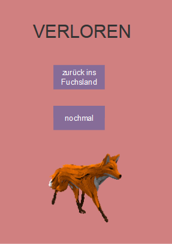

# Projektseite 2

## Fuchsland

## Inhaltsverzeichnis

* [Projektvorstellung](#projekt)
  * [Die Intention der App](#Intention)
* [Die App selber programmieren](#dssp)
  * [App Lab - Code.org](#al)
  * [Erste Schritte](#erste)
  * [Das Spiel programmieren](#Spiel)
  * [Den Test programmieren](#Test)
  * [Das Quiz programmieren](#Quiz)
  * [Weitere Screens](#weitere)

## Projektvorstellung 

Bei dem Projekt "Fuchsland" handelt es sich um eine App, die mit App Lab-Code.org erstellt wurde. 

Die App besteht aus drei Ebenen, einer Spiel-, einer Quiz- und einer Testebene, die unabhängig voneinander gespielt werden können. Die gesamte App dreht sich um das Thema Klimaschutz und Klimawandel, damit der Nutzer auch etwas beim Benutzen der App lernt. 

Man erreicht die verschiedenen Ebenen der App von dem Screen aus, der das "Fuchsland" darstellt. Ein Fuchs begleitet den Nutzer durch die App und taucht an verschiedenen Stellen in unterschiedlichen Ebenen auf. 

### Die Quizebene

(BILD VON QUIZ FRAGE1, FFRAGE 1 UND RICHTIG) = 3 BILDER

Die Quizebene testet das Wissen des Nutzers über den Klimawandel.
In diesem Teil der App gibt es zehn Fragen zum Klimawandel mit jeweils drei Antwortmöglichkeiten, wovon der Nutzer eine anklicken und durch das Klicken auf "Weiter" einloggen kann. 

Bei falscher bzw. richtiger Antwort wird man zu einem entsprechenden Screen weitergeleitet, auf dem man einen passenden Erklärtext bzw. Ergänzungen zur richtigen Antwort findet. Von dort aus kann man zur nächsten Frage weitergehen. 
Nach jeder Antwort wird dem Spieler direkt angezeigt, ob er richtig oder falsch geantwortet hat. 

Am Ende des Quizzes bekommt er zusätzlich eine Übersicht, die die Anzahl der richtigen und falschen Antworten anzeigt. 
Der Spieler hat die Möglichkeit das Wuiz zu wiederholen oder zum "Fuchsland" zurückzukehren. 

ÜBERICHT AM ENDE

### Die Testebene

(BILD VON Test1

Die Testebene dient dazu, dass der Spieler sein eigenes Verhalten reflektiert und herausfindet,ob er bereits genug für den Klimaschutz tut.
Der Test besteht aus sieben verschiedenen Fragen mit jeweils zwei Antwortmöglichkeiten. 
Auf dem Screen einer Testfrage befinden sich neben der Frage selber die Antwortmöglichkeiten in Form von Bildern. 
Das Besondere ist der kleine Fuchs am unteren Rand jedes Screens. Er lässt sich mit den Pfeiltasten der Tastatur auf das jeweilige Bild steuern, welches der Spieler als Antwort wählen möchte.
Erreicht der Mittelpunkt des Fuchses das jeweilige Bild, wird die Antwort eingeloggt und der Spieler gelangt zu der nächsten Frage. 

Pro Screen gibt es eine Antwort, die vorbildlich und gut für das Klima ist, die andere Antwort hingegen schadet unserer Umwelt.
Für den Spieler unsichtbar wird je nach ausgewählter Antwort eine unterschiedliche Punkteanzahl zu einem Score addiert. 
Ist die Antwort des Spielers gut für das Klima, so bekommt er für diese null Punkte. 
Steuert der Spieler den Fuchs auf die Antwort, die schädlich für unser Klima ist, so werden ein oder zwei Punkte zu dem Score hinzu addiert. 
Dies ist abhängig davon wie stark die Antwort unserem Klima schadet. Flugzeuge beispielsweise sind sehr schädlich für unsere Umwelt, deshalb gibt das Einloggen des Flugzeuges zwei Punkte.

Nach den sieben Fragen wird dem Spieler sein ereichter Score angezeigt. Je niedriger dieser ist, desto besser ist das Engagement des Spielers für den Umweltschutz. 
Mit folgender Tabelle kann der Spieler schauen wie er abgeschnitten hat und sein Ergebnis einstufen. 
Anschließend hat er die Möglichkeit ins Fuchsland zurückzukehren oder sich sieben Tipps anzeigen zu lassen, wie er persönlich mehr für den Klimaschutz machen kann. 

ENDSCREEN
SCREEN MIT TIPPS

### Die Spielebene

In der Spielebene wird der Spieler virtuell aktiv gegen den Klimawandel. Er hilft Müll in Form von Plastikflaschen von einer Wiese aufzusammeln. 
Dazu muss der Spieler innerhalb von 20 Sekunden so oft wie möglich auf eine Plastikflasche klicken, die nach jedem KLick ihre Position zufällig ändert. 

Am oberen Rand des Screens wird die Anzahl der bereits angeklickten Flaschen angezeigt.
Der Timer wird am unteren Rand des Screens mitgezählt, sodass der Spieler weiß, wie viel Zeit ihm noch bleibt.
Außerdem hat man während eines Spiels drei Leben, klickt man versehentlich neben die Flasche (und damit auf den Hintergrund) verliert man ein Leben.
Die Anzahl der noch vorhandenen Leben wird ebenfalls am oberern Rand des Screens angezeigt.

Schafft man es, innerhalb der 20 Sekunden mindestens 10 Mal auf die Flasche zu klicken, ohne dabei 3 Leben zu verlieren, hat man gewonnen und wird auf einen entsprechenden Screen weitergeleitet. Von dort aus kann man das Spiel nochmal spielen oder ins Fuchsland zurückkehren.

Wenn man aber nach den 20 Sekunden weniger als 10 Klicks geschafft hat oder alle 3 Leben verloren hat, wird einem der Verloren-Screen angezeigt. Von dort aus kann man genauso fortfahren wie beim Gewonnen-Screen.

## Die Intention der App 

Mit der App "Fuchsland" sollen der Spaß beim Spielen und das Erweitern des Wissens über das Thema Klimawandel miteinender vereint werden. Das Spiel soll somit zum Lernen motivieren, aber auch das Bewusstsein dafür stärken, in welcher aktuellen Lage die Erde steckt und somit auch wir Menschen. 
Die Spieler lernt außerdem, inwiefern sein eigenes Verhalten den Klimawandel beeinflusst und wie er sich selber für unser KLima einsetzen kann. 
Durch den Spaß in der Spielebene und das virtuelle Aufsammeln von Müll dort könnte der Spieler auch unterbewuust dazu animiert werden, ebenfalls in der realen Welt keinen Müll in die Ladschaft zu werfen oder den von fremden Menschen aufzusammeln. 

Die Hauptzielgruppe der App "Fuchsland" sind Kinder zwischen sieben und sechzehn. 
Das liegt maßgeblich daran, dass das der Design der Appp auf diese Altersgruppe wahrscheinlich sehr ansprechend wirkt und Kinder in dem Alter oft noch wenig wissen über den Klimaschutz haben und so besonders viel lernen können.  
Dennoch sind beim Quiz durchaus anspruchsvolle Fragen enthalten, die Allgemeinbildung vorraussetzen. 
Somit können auch Erwachsene durch diese App viel über den Klimaschutz und ihr eigenes Verhalten dazulerenen.
Deswegen ist die App "Fuchsland" grundsätzlich für alle Altersklassern geeignet. 

## Die App selber programmieren 

## App Lab - Code.org 

Bevor man mit dem Programmieren des Spiels beginnt, sollte man sich erst mit dem Programm vertraut machen.

Code.org ist ein gemeinnütziges Unternehmen aus den USA und wurde 2013 gegründet. Die Grundidee hinter der Programmierungswebsite besteht darin, jedem die Möglichkeit zu geben, Programmieren zu lernen. Außerdem soll die Programmierfähigkeit besonders in der Schule gefördert werden. 

MIT App Inventor ist online frei zugänglich, vor der ersten Anwendung muss man sich mit seiner E-mail-Adresse registrieren. Danach kann man begonnene Projekte online speichern, sodass man jederzeit darauf zugreifen kann und diese weiterbearbeiten kann.

Das Programmieren auf Code.org basiert auf Java, ist aber durch die Blocks, die sinnvoll zusammengefügt werden müssen, relativ einfach und somit für Anfänger geeignet. Dadurch, dass Code.org auf viele Sprachen eingestellt werden kann, kann man bei Verständnisschwierigkeiten auch z.B. auf Deutsch programmieren. Wenn man allerdings schon mit anderen Programmen gearbeitet hat, kann die Umstellung auch eher irritieren, da manche Befehle eher auf Englisch vertraut sind.

Ein Code.org-Projekt teilt sich in drei Ebenen auf, den Code-, Design- und den Data-Editor. Letzteres haben wir für unsere App nicht verwendet, da er genutzt werden kann, um Daten wie Highscores außerhalb der App zu speichern.

### Der Code-Editor:

In dem Block Editor kann man per Drag and Drop verschiedene Blocks aus der Tool Box aus den verschiedenen Kategorien auf die rechte Fläche ziehen. Diese Blocks kann man beliebig miteinander kombinieren und bei einigen selber bestimmte Befehle oder Dinge wie Definitionen und Benennungen dazutragen. Man kann verschiedene Screens miteinander verknüpfen, die Bewegung der Objekte programmieren und entscheiden, was beim Anklicken bestimmter Buttons, Labels oder anderer Objekte passiert.

Zudem kann die Ansicht der Blocks gewchselt werden, indem man oben rechts auf "Show Text" klickt. Diese Ansicht kann weniger übersichtlich sein, aber das ist für jeden unterschiedlich. Wenn man allerdings in dieser Textansicht einen Fehler einbaut, kann man nicht zu Block-Ansicht zurückkehren, bevor der Fehler behoben wurde. 

Das Besondere an Code.org ist aber auch, dass einem die Ursachen für Fehler angezeigt werden. Einmal direkt an den Blocks...

...und in der Debug Console, wo auch längere Ausführungen über die Ursachen stehen können. Diese können häufig dabei helfen, den Fehler zu beheben und erleichtern somit das Programmieren.

### Der Design-Editor:

In dem Design Editor kann man Hintergründe, Images, Textlabels o.Ä. erstellen und sie oben rechts in dem Kasten *id* umbenennen,z.B. um bei der Programmierung dieser Objekte nicht den Überblick zu verlieren. Dazu kann man Bilder von seinem eigenen Computer oder aus dem Internet in das Projekt hochladen. 

Bei Code.org kann man so viele verschiedene Screens erstellen, wie man möchte und sie z.B. auch duplizieren, um sich Arbeit zu ersparen. Diese Möglichkeiten sind für unser Projekt sehr praktisch, da wir durch die Quiz-, Spiel-, und Testebene viele, ähnliche Screens brauchen.

## Erste Schritte 

Zunächst muss ein neues Projekt gestartet werden. Bevor man mit dem Programmieren beginnt, sollte einem das allgemeine Konzept der App bereits bewusst sein. Generell hat Code.org den Vorteil, dass das Projekt, die Screens und alle Objekte wie Buttons, Labels und TextAreas zu jeder Zeit umbenannt werden können, was große Flexibilität ermöglicht, falls man neue Ideen bekommt oder Korrekturen vornehmen möchte.

Trotzdem sollte schon ab Erstellen des ersten Screens jedes Objekt sinnvoll benannt werden. Das verschafft Übersicht, sobald die Programmierung komplexer wird und ist auch für eventuelle Nachahmer nachvollziehbarer.

## Das Spiel programmieren 

Das Spiel beginnt mit dem Startscreen, von dem man durch einen Button zum eigentlichen Spiel gelangt. Mit dem Anklicken des Buttons *startbs* werden außerdem die Textlabels score, lives und timer benannt und definiert, sodass auf dem Screen *Clicker* diese durch bestimmte Ereignisse sich wie Variablen verhalten und geändert werden können. Gleichzeitig wird *Clicker*  initialisiert.

   
    Bei diesem Programm bzw. der App ist es wichtig, Variablen zu definieren, 
    bevor sie in den eigentlichen Blocks verwendet werden.
    
So wird auch hier zuerst die Variable *timer* definiert und erhält den Wert 20 (Sekunden).   
Mit der Initialisierung des Screens *Clicker* wird dann der Timer aktiviert...1000.. und wird mit `timer-1` so programmiert, dass die Uhr rückwärts läuft und durch den Block `setText "timer" = timer` für den Spieler sichtbar ist.
 
Der Operator `(if) timer==0` lässt den nächsten Befehl erst ausführen, wenn die Bedingung `x==y` true, also erfüllt ist. Ist der Timer auf 0 Sekunden abgelaufen, werden die Variablen score, lives und timer wieder auf ihre Anfangswerte festgelegt, der Timer gestoppt und der Screen *verloren* erscheint.
 
 

Die Programmierung für den Screen *Clicker* ist ähnlich. Auch hier wird der Text für lives und score festgelegt und diese zusätzlich noch definiert. Hinzu kommt, dass die Plastikflasche mit dem Block `setPosition (Müll), randomNumber(x,y)...` so programmiert wird, dass sie nach jedem Klick eine zufällige Position auf dem Bildschirm einnimmt. 

Auch hier wird wieder der true/false-Block `score==10`benutzt. Dementsprechend werden die folgenden Befehle erst ausgeführt, wenn der Spieler 10 Mal auf die Flasche geklickt hat und damit einen Score von 10 hat. Mit dieser erfüllten Bedingung wird der Screen *gewonnen* initialisiert, der Timer gestoppt und die Werte von score, lives und timer zurückgesetzt

Außerdem muss programmiert werden, was passieren soll, wenn der Spieler auf den Hintergrund statt auf die Flasche klickt. Dafür wird der (bei uns) häufig benutzte Block `onEvent ("background", "click"9..` eingesetzt. Auch die anderen Befehle ähneln den Vorherigen. So wird pro Klick auf den Hintergrund ein Leben abgezogen und sobald keine Leben mehr übrig sind, der Screen *verloren* angezeigt und die Werte zurückgesetzt.

Auf dem *verloren*- und *gewonnen*-Screen sind Buttons programmiert, die mit dem eben genannten `onEvent`- Block ausgeführt werden können und den Spieler je nach Wunsch in das Fuchsland zurückkehren oder ihn das Spiel nochmal spielen lassen:

## Den Test programmieren 

Die folgende Blockkombination legt fest, dass bei der Initialisierung vom Screen *test1* die Variable *score3* definiert und den Wert 0 erhält. Dieser Score zeigt später durch das *label130* auf screen *testEnde* die Gesamtpunktzahl an.

Für die nächsten, etwas aufwendigeren Programmierungen muss die Funktion von den beiden folgenden Blöcken bekannt sein:

 

Mit dem ersten kann man seine eigene Funktion aus mehreren Parametern erstellen, sie benennen und sie damit definieren (define). Gerade bei längeren Befehlen ist der Block also praktisch. Denn sobald man sie benannt hat, kann man diese mithilfe des zwieten blocks `myfunction(id)` bei anderen Blocks wie `if (id)`oder `onEvent(id)`einfügen, wo sie durch dieses Aufrufen (call) ausgeführt werden. So haben wird auch den größte Teil des Tests programmiert.

Die erste eigene Funktion heißt *movef* und beinhaltet die Parameter zur Steuerung des Fuchses. Hier werden die Variablen *xVel* und *yVel*, also die x- und y-Werte auf dem Koordinatensystem, definiert und gleich 0 gesetzt. 
Als nächstes folgt ein Statement-Block, also `if (...)`. Zusätzlich gibt es drei weitere `else if (...)`Befehle bzw. Bedingungen. Wird die Pfeiltaste nach oben auf der Tastatur gedrückt und damit die Bedingung `if (event.key==up)`wahr (true), wird der Befehl `yVel = -5`ausgeführt: Der Fuchs bewegt sich um 5 y-Einheiten vertikal aufwärts. Wird hingegen die Pfeiltaste nach rechts gedrückt, sind die anderen 3 Bedingungen falsch (false) und die Bedingung `if (event.key==right)`wahr, wird der x-Wert vom Fuchs um 5 x-Einheiten nach rechts verändert. Um die Steuerung möglich zu machen, muss mithilfe des letzten Blocks noch einmal festgelegt werden, dass die Position des Fuchses um diesen neu definierten x-/y-Wert ( `getXPosition (fuchs) + xVel/yVel` ) verändert wird.

Die zweite eigene Funktion heißt *check* und beinhaltet die Variablen *fuchs*, *image1*, *image2*, *screen*, *point1* und *point2*. Mit der gesamten Funktion wird programmiert, was passiert wenn der Fuchs auf welchem Screen welches Bild (*image1* oder *image2*) berührt und wie viele Punkte (1 oder 2 Punkte) daraufhin dem Score hinzugerechnet werden. 

Nun werden die erstellten Funktionen durch die folgenden Blocks als Befehle ausgeführt, indem man die Funktionen wie Variablen einfügt.

## Das Quiz programmieren 

##### Die Fragen

##### Programmierung des Scores

BILD VON ENDEQUIZ DESIGN

 

## Weitere Screens 

