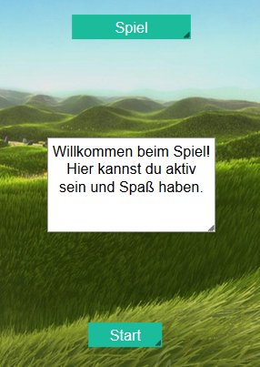

# Projektseite 2

## Fuchsland

## Inhaltsverzeichnis

* [Projektvorstellung](#projekt)
  * [Die Intention der App](#Intention)
* [Die App selber programmieren](#dssp)
  * [App Lab - Code.org](#al)
  * [Erste Schritte](#erste)
  * [Das Spiel programmieren](#Spiel)
  * [Den Test programmieren](#Test)
    * [Die Fragen](#Fragen1)
  * [Das Quiz programmieren](#Quiz)
    * [Die Fragen](#Fragen2)
  * [Weitere Screens](#weitere)

## Projektvorstellung 

Unser Projekt ist eine App, die wir mit App Lab-Code.org erstellt haben. Die App besteht aus einer Spiel-, Quiz- und Testebene, die unabhängig voneinander gespielt werden können und sich alle um das Thema Klimaschutz und Klimawandel drehen, damit der Nutzer auch etwas beim Spielen lernt. Man erreicht diese verschiedenen Ebenen vom Startscreen (siehe oben) aus, der das Fuchsland darstellt. Außerdem wird man von einem Fuchs durch die App begleitet.

### Die Quizebene

(BILD VON QUIZ FRAGE1, FFRAGE 1 UND RICHTIG)

In diesem Teil der App gibt es 10 Fragen zum Klimawandel mit jeweils drei Antwortmöglichkeiten. Bei richtiger bzw. falscher Antwort wird man zum entsprechenden Screen weitergeleitet, wo es den passenden Erklärtext bzw. Ergänzungen zur richtigen Antwort gibt. Von dort aus kann man zur nächsten Frage weitergehen. SCORE?

### Die Testebene

(BILD VON Test1, Endescreen)

In dieser Ebene kann der Spieler sich in 5 Fragen selber testen, ob er genug für den Klimaschutz tut. Oben in Screen steht die Frage, darunter die Antwortmöglichkeiten in Form von Bildern und darunter wiederum der Fuchs, der sich mithilfe der Pfeiltasten zum jeweiligen Bild steuern lässt.
Jenachdem, welche Antwort gewählt wird, wird dem Score 1 (gut für das Klima) oder 2 Punkte (schlecht für das Klima) hinzugefügt.
Nach den 5 Fragen wird dem Spieler sein Endergebnis und die entsprechende Bewertung angezeigt. 

### Die Spielebene

Beim Spiel soll man innerhalb von 20 Sekunden so oft wie möglich auf eine Plastikflasche klicken, die nach jedem KLick ihre Position zufällig ändert. Außerdem hat man 3 Leben, die zusammen mit dem Score am oberen Bildschirmrand mitgezählt werden.

Schafft man es, innerhalb der 20 Sekunden mindestens 10 Mal auf die Flasche zu klicken, ohne dabei 3 Leben zu verliere, erscheint der Screen, dass man gewonnen hat. Von dort aus kann man nochmal spielen oder ins Fuchsland zurückkehren:

Wenn man aber nach den 20 Sekunden weniger als 10 Klicks geschafft hat oder alle 3 Leben verloren hat, wird einem der Verloren-Screen angezeigt. Von dort kann man genauso fortfahren wie beim Gewonnen-Screen.

## Die Intention der App 

Mit der App "Fuchsland" sollen der Spaß beim Spielen und das Erweitern des Wissens über das Thema Klimawandel miteinender vereint werden. Das Spiel soll somit zum Lernen motivieren, aber auch das Bewusstsein dafür stärken, in welcher aktuellen Lage die Erde steckt, und somit auch wir Menschen, und inwiefern unser Verhalten diesen Zustand bzw. den Klimawandel selbst beeinflusst. 
Durch das allgemein kindliche Design und das Spiel ist die App zwar für jüngere Kinder geeignet, das Quiz erfordert allerdings etwas mehr Allgemeinbildung. Somit ist die App generell für mehrere Zielgruppen geeignet.

## Die App selber programmieren 

## App Lab - Code.org 

Bevor man mit dem Programmieren des Spiels beginnt, sollte man sich erst mit dem Programm vertraut machen.

Code.org ist ein gemeinnütziges Unternehmen aus den USA und wurde 2013 gegründet. Die Grundidee hinter der Programmierungswebsite besteht darin, jedem die Möglichkeit zu geben, Programmieren zu lernen. Außerdem soll die Programmierfähigkeit besonders in der Schule gefördert werden. 

MIT App Inventor ist online frei zugänglich, vor der ersten Anwendung muss man sich mit seiner E-mail-Adresse registrieren. Danach kann man begonnene Projekte online speichern, sodass man jederzeit darauf zugreifen kann und diese weiterbearbeiten kann.

Das Programmieren auf Code.org basiert auf Java, ist aber durch die Blocks, die sinnvoll zusammengefügt werden müssen, relativ einfach und somit für Anfänger geeignet. Dadurch, dass Code.org auf viele Sprachen eingestellt werden kann, kann man bei Verständnisschwierigkeiten auch z.B. auf Deutsch programmieren. Wenn man allerdings schon mit anderen Programmen gearbeitet hat, kann die Umstellung auch eher irritieren, da manche Befehle eher auf Englisch vertraut sind.

Ein Code.org-Projekt teilt sich in drei Ebenen auf, den Code-, Design- und den Data-Editor. Letzteres haben wir für unsere App nicht verwendet, da er genutzt werden kann, um Daten wie Highscores außerhalb der App zu speichern.

### Der Code-Editor:

In dem Block Editor kann man per Drag and Drop verschiedene Blocks aus der Tool Box aus den verschiedenen Kategorien auf die rechte Fläche ziehen. Diese Blocks kann man beliebig miteinander kombinieren und bei einigen selber bestimmte Befehle oder Dinge wie Definitionen und Benennungen dazutragen. Man kann verschiedene Screens miteinander verknüpfen, die Bewegung der Objekte programmieren und entscheiden, was beim Anklicken bestimmter Buttons, Labels oder anderer Objekte passiert.

Zudem kann die Ansicht der Blocks gewchselt werden, indem man oben rechts auf "Show Text" klickt. Diese Ansicht kann weniger übersichtlich sein, aber das ist für jeden unterschiedlich. Wenn man allerdings in dieser Textansicht einen Fehler einbaut, kann man nicht zu Block-Ansicht zurückkehren, bevor der Fehler behoben wurde. 

Das Besondere an Code.org ist aber auch, dass einem die Ursachen für Fehler angezeigt werden. Einmal direkt an den Blocks...

...und in der Debug Console, wo auch längere Ausführungen über die Ursachen stehen können. Diese können häufig dabei helfen, den Fehler zu beheben und erleichtern somit das Programmieren.

### Der Design-Editor:

In dem Design Editor kann man Hintergründe, Images, Textlabels o.Ä. erstellen. Dazu kann man Bilder von seinem eigenen Computer oder aus dem Internet in das Projekt hochladen. Bei Code.org kann man so viele verschiedene Screens erstellen, wie man möchte und sie z.B. auch duplizieren, um sich Arbeit zu ersparen. Diese Möglichkeiten sind für unser Projekt sehr praktisch, da wir durch die Quiz-, Spiel-, und Testebene viele, ähnliche Screens brauchen.

## Erste Schritte 

Zunächst muss ein neues Projekt gestartet werden. Bevor man mit dem Programmieren beginnt, sollte einem das allgemeine Konzept der App bereits bewusst sein. Generell hat Code.org den Vorteil, dass das Projekt, die Screens und alle Objekte wie Buttons, Labels und TextAreas zu jeder Zeit umbenannt werden können, was große Flexibilität ermöglicht, falls man neue Ideen bekommt oder Korrekturen vornehmen möchte.

Trotzdem sollte schon ab Erstellen des ersten Screens jedes Objekt sinnvoll benannt werden. Das verschafft Übersicht, sobald die Programmierung komplexer wird und ist auch für eventuelle Nachahmer nachvollziehbarer.

## Das Spiel programmieren 
====================================================

Das Spiel beginnt mit dem Startscreen, von dem man durch einen button zum eigentlichen Spiel gelangt. Mit dem Anklicken des Buttons *startbs* werden außerdem die Textlabels Score, Lives und timer benannt und definiert, sodass auf dem Screen Clicker diese durch bestimmte Ereignisse sich wie Variablen verhalten und geändert werden können. Gleichzeitig wird Clicker initialisiert.

## Den Test programmieren 

### Die Fragen 

## Das Quiz programmieren 

### Die Fragen 

## Weitere Screens 

